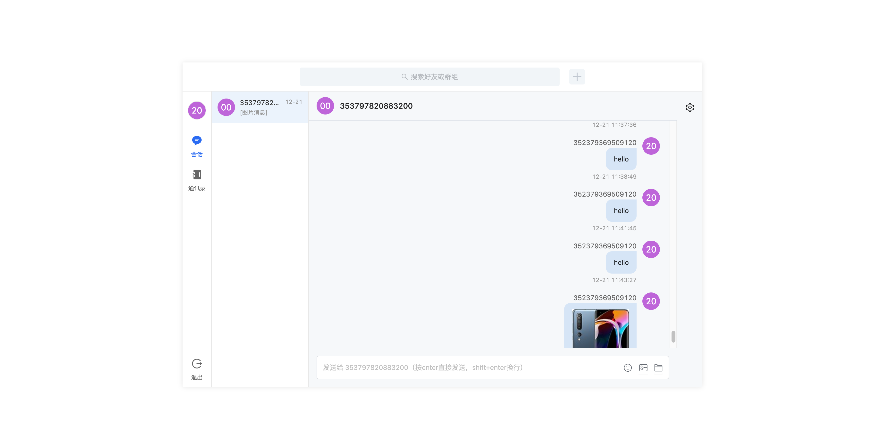

# 云信 IM UI Kit

本仓库放置了云信 UIKit 的源码和相应的示例代码，可以帮助您快速集成 UIKit 以及深入了解 UIKit。

- [React 用户点击这里](./react/)
- [Vue 用户点击这里](./vue/)

## 运行效果

Web（React 和 Vue）： 

想了解更多，[点击进入官网](https://doc.yunxin.163.com/messaging/docs/TExNjE0MzQ?platform=web)